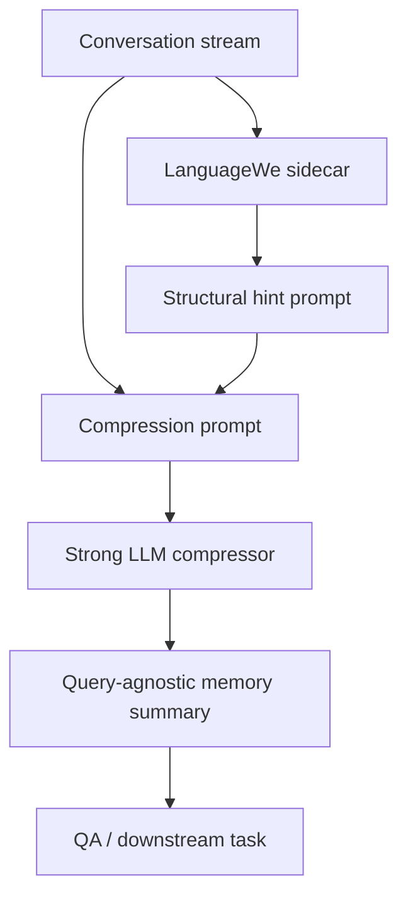

# PhasePrompt

**A structural sidecar for long-context conversation compaction.**

PhasePrompt is a research-preview repository for a query-free structural
sidecar that watches a conversation stream and emits compact structural hints
for downstream language models.

The current public release focuses on a single engineering result:

> In a LoCoMo-MC pilot, LanguageWe structural hints improved DeepSeek-chat's
> query-agnostic conversation summaries by **+4.2 percentage points** over a
> recency-hinted compression prompt on 497 multiple-choice QA items.

This is not a leaderboard claim and not a full memory-system comparison. The
result is a sidecar-gain claim: no model weights are changed, no embeddings are
used by the sidecar, no training is performed, and no query-time retrieval is
required by the sidecar scoring layer.

## Why This Matters

Most long-context memory systems begin from recency, retrieval, embeddings, or
semantic summarization. PhasePrompt tests a different layer: structural dynamics
in the token/message stream.

The sidecar asks:

> Which turns look structurally important before the model is asked a question?

That makes it useful as an additive module rather than a replacement for RAG,
long-context models, or summarization pipelines.

## Current Result

LoCoMo-MC, 10 long multi-session conversations, 497 stratified QA items.
Reader/compressor: DeepSeek-chat, temperature 0.

| Condition | Accuracy | vs Recency |
|-----------|----------|------------|
| NOCTX | 37.8% | -15.5pp |
| SUM_NONE | 55.1% | +1.8pp |
| SUM_REC | 53.3% | baseline |
| **SUM_LW** | **57.5%** | **+4.2pp** |
| SUM_HYB | 53.7% | +0.4pp |

Paired comparison:

| Pair | Wins | Losses | Ties | Net |
|------|------|--------|------|-----|
| SUM_LW vs SUM_REC | 65 | 44 | 388 | +21 |

Answering-stage token use also fell:

| Metric | SUM_REC | SUM_LW | Change |
|--------|---------|--------|--------|
| QA input tokens | 400,200 | 305,433 | **-23.7%** |
| Avg QA input tokens | 805 | 615 | **-190 tokens/question** |

This token reduction is measured on the saved QA calls after summaries were
generated. It does not mean the whole evaluation used fewer tokens end to end:
the LW compression prompt includes a structural hint. The practical value is
that a better compact memory can be reused across later questions at a lower
per-query context cost.

By question type, SUM_LW beats SUM_REC on 4/5 categories. The only trailing
category is multi-hop QA, where temporal proximity across sessions appears to
help recency.

## Workflow



The public repository exposes the report, protocol, and result artifacts. The
current production LanguageWe implementation is under controlled disclosure.

## Repository Layout

```text
PhasePrompt/
  README.md
  docs/
    architecture.md
    disclosure_policy.md
  protocols/
    locomo_t2_protocol.md
  reports/
    locomo_sidecar_report_2026-06-04.md
  artifacts/
    locomo_t2/
      README.md
      t2_main_20260604_1224_manifest.json
      t2_main_20260604_1224_results.jsonl
      t2_main_20260604_1224_summaries.jsonl
      t2_stream_20260604_1318_results.jsonl
  tools/
    verify_locomo_results.py
  examples/
    sidecar_contract_example.json
```

## Reproduce the Reported Metrics

No API key is needed to verify the saved result artifacts.

```bash
python tools/verify_locomo_results.py artifacts/locomo_t2/t2_stream_20260604_1318_results.jsonl
python tools/verify_locomo_results.py artifacts/locomo_t2/t2_main_20260604_1224_results.jsonl --full
```

Expected headline for the stream run:

```text
SUM_REC  acc=53.3%
SUM_LW   acc=57.5%
SUM_LW vs SUM_REC: 65W/44L/388T net=+21
```

## Public Boundary

This repository is intended for research preview and technical review.

Public:

- LoCoMo result artifacts.
- Experimental protocol.
- Result verification script.
- Architecture-level interface contract.
- Limitations and reproducibility notes.

Controlled for now:

- Full LanguageWe implementation.
- Continuous streaming state-update logic.
- TokenCodex / SyntaxCR internals.
- Production-ready agent-memory integration.

See [docs/disclosure_policy.md](docs/disclosure_policy.md).

## Contact

For technical review, controlled implementation access, or research discussion:

[jackey.l.gene@outlook.com](mailto:jackey.l.gene@outlook.com)

## Limitations

- This is a pilot, not an industry benchmark.
- The stream run did not save summaries and manifest as separate artifacts.
- The FULL reference uses a separate 50-QA sample and should not be read as a
  strict upper bound.
- The saved results validate the measured gain, not the unpublished sidecar
  implementation.
- A full protocol run should preserve stream summaries, stable qid sampling,
  tokenizer-based budgets, and all prompts.

## License

Copyright (c) 2026 Jackey Liu.

No open-source license is granted for this repository at this time. The material
is shared for research preview and technical review only. Reuse,
redistribution, modification, or commercial use requires explicit written
permission from the author.

Reports and result artifacts may be cited with attribution. Core implementation
access is controlled while the disclosure and licensing policy is being
finalized.
