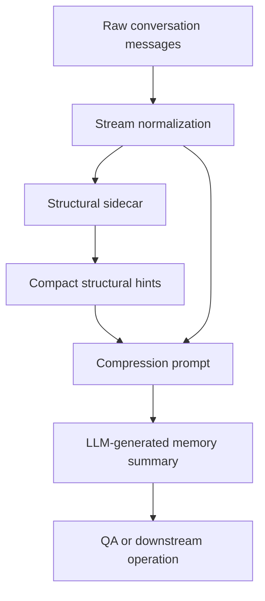

# Architecture

PhasePrompt is an external structural sidecar for long-context language streams.
It does not replace a language model. It emits compact hints that a downstream
model can use during compression, summarization, QA, or audit.

## Public Interface

The intended public interface is deliberately small:

```text
input:
  ordered messages or sentences

sidecar output:
  compact structural hint
  optional selected turn ids
  optional residue labels

downstream use:
  insert hint into a compression prompt
  ask the model to create a query-agnostic memory summary
  answer future questions from that summary
```

The current public repo does not expose the production LanguageWe internals. It
documents the protocol and provides result artifacts for verification.

## Sidecar Flow



## What the Sidecar Is Not

- It is not an embedding retriever.
- It is not a semantic parser.
- It is not a fine-tuned model.
- It is not a replacement for a long-context LLM.
- It is not an autonomous agent memory system in this public release.

## What It Tests

The current LoCoMo experiment tests whether a structural hint can improve
query-agnostic conversation compaction. This is a narrow but important use case
for agent memory:

1. An agent has a long conversation history.
2. A sidecar runs continuously or after the session.
3. The sidecar emits structural hints.
4. A strong LLM compresses the conversation with those hints.
5. Future QA uses the compressed memory.

## Why Query-Agnostic Compaction

Query-specific retrieval can always optimize for a known question. Agent memory
often does not know future questions. Query-agnostic compaction is therefore a
stricter test of whether a sidecar can help preserve generally useful structure.

